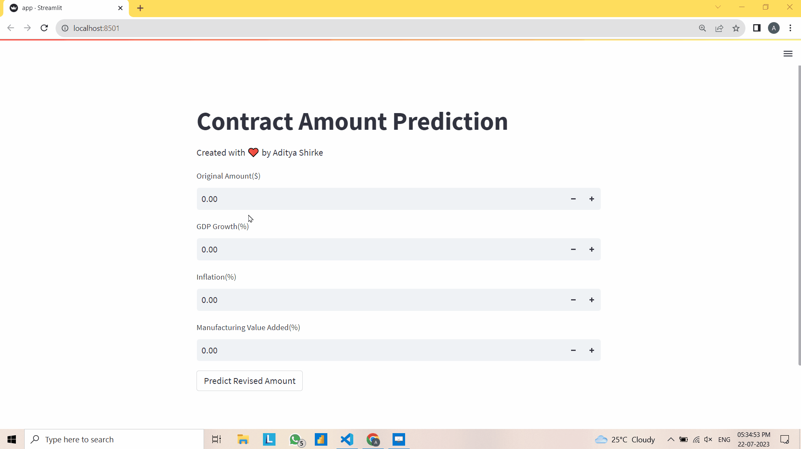

# Contract Amount Prediction

This project, titled "Contract Amount Prediction," was part of the Data Hackathon at Vconstruct, held on July 21, 2023. The goal of this project was to develop a predictive model that can estimate the revised contract amount based on various economic factors. The dataset used for this project included information on contract details, economic indicators, and vendor information.

## Project Overview

The objective of the project was to build a predictive model that takes input features such as 'original_amount', 'GDP_growth', 'inflation', and 'manufacturing_value_added' to predict the 'revised_amount' for construction and repair contracts. The model was implemented using an Artificial Neural Network (ANN) and achieved an accuracy of 81% after fine-tuning.

## Data Source and Preprocessing

The dataset used for this project included the following fields:

- OBJECTID
- contract_number
- contract_description
- contract_status
- contract_type
- contract_subtype
- last_modified
- original_amount
- revised_amount
- vendor_id
- vendor_name
- objectid_1

To incorporate relevant economic indicators, data from the World Bank API was integrated based on the 'last_modified' field, which represents the date of modification.

The economic factors from the World Bank API included:

- GDP growth (annual %)
- Inflation, consumer prices (annual %)
- Manufacturing value added (% of GDP)
- Official exchange rate (local currency units per US$)

## Project Lifecycle

The project followed the following lifecycle:

1. **Data Acquisition**: The initial step involved obtaining the dataset and the economic indicators from the World Bank API.

2. **Data Preprocessing**: The data was cleaned, and missing values were handled. Categorical features were converted into numeric using one-hot encoding. The 'last_modified' column was separated into 'year', 'month', and 'day' columns.

3. **Data Exploration and Visualization**: Exploratory Data Analysis (EDA) was performed to gain insights into the data. Visualizations such as histograms, box plots, and correlation matrices were created to understand feature distributions and relationships.

4. **Model Building**: An Artificial Neural Network (ANN) model was chosen for contract amount prediction. The data was split into training and testing sets, and the model was trained using the training data. Hyperparameters were tuned to optimize the model's performance.

5. **Model Evaluation**: The trained model's performance was evaluated using metrics such as Mean Squared Error (MSE) and R-squared (R2).

6. **Model Deployment**: The trained ANN model was saved in an HDF5 file ('Contract_prediction_model.h5'). The StandardScaler used for feature scaling during training was saved as 'scaler.pkl'.

7. **Streamlit Application**: A Streamlit application was created to provide an interactive interface for users to input contract details and obtain the predicted revised amount.

## Demo

The project includes a demo gif file showcasing how the Streamlit application works. The gif demonstrates the user interface and the process of entering contract details and receiving the predicted revised amount.

For more details and to run the Streamlit application locally, please refer to the 'app.py' file.

## Conclusion

The "Contract Amount Prediction" project successfully developed a predictive model to estimate revised contract amounts for US-specific contracts. The ANN model achieved an accuracy of 81%, providing valuable insights for contract management and financial planning. The integration of economic indicators from the World Bank API enhanced the model's predictive power, making it a valuable tool for decision-making in the construction and repair domain.

